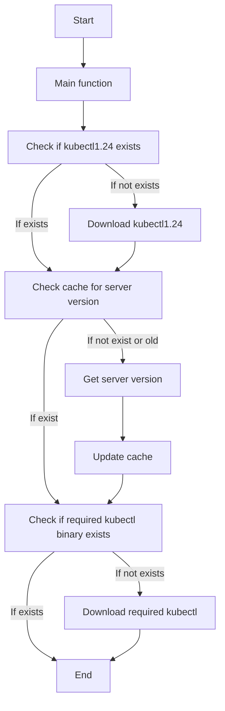

# Kubectl Auto Version

This script will automatically **download** and **select** the appropriate `kubectl` version for the Kubernetes context utilized by the `kubectl` command.

The relation between the context and version is preserved in a cache file, avoiding redundant version discovery operations.

It's recommended to keep client/server versions closely aligned to avoid inconsistencies between API versions.

You will also avoid messages like this:
```
WARNING: version difference between client (1.22) and server (1.24) exceeds the supported minor version skew of +/-1
```


## Prerequisites

- Make sure you have `curl` and `jq` installed.
- By default, the script will try to use the Kubernetes client `1.24`, so it can connect to the target cluster to get the cluster version, then, if necessary, it'll download and use the correct client version.

## Installation

Ensure the script is executable and available in your PATH:

```bash
git clone https://github.com/d1egoaz/kubectl-auto-version.git
cd kubectl-auto-version

# Adding the script to PATH by creating a symbolic link
sudo ln -s $PWD/kubectl-auto-version /usr/local/bin/kubectl
```

You can also use something like `/usr/local/bin/k` for the symbolic link name.

## Usage

All arguments are passed directly to the underlying `kubectl` downloaded binary.

### Caching

To ensure the script runs swiftly, `kubectl-auto-version` caches the Kubernetes server versions it has connected to successfully to avoid repeated version discovery operations.
The cache file, named `kubectl_version_cache`, is stored in the same directory as the `kubectl-auto-version` script.

Each successful connection to a Kubernetes server gets logged in the cache file along with its version. Here's an example of a cache file entry:

```bash
my-k8s-cluster 1.24
my-k8s-cluster-upgrade-test 1.26
```

In this example, `my-k8s-cluster` is the context name and `1.24` is the version of the Kubernetes server.

Remember to clean this file if your cluster context changes or if you upgrade your Kubernetes cluster.

## Updating

To update the script to the latest version, navigate to the directory where you cloned the repository and pull the latest version:

```bash
cd /path/to/kubectl-auto-version
git pull
```

## Process Flowchar

Simplified version of the process.


